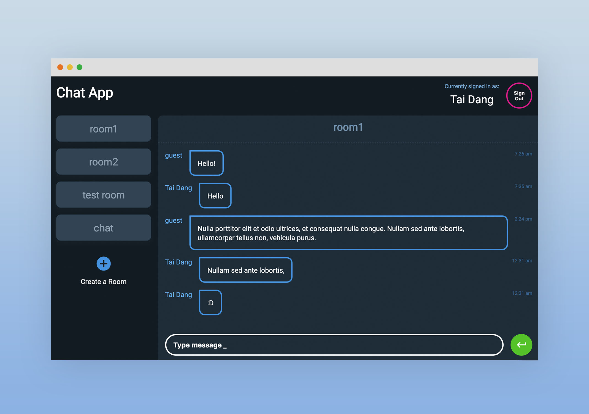

# Chat App

A simple App using React with Firebase to build an application that sends and receives messages in real time.

[Demo](https://firebase-react-chat.herokuapp.com/) - _Allow a few seconds for the server to start up._

## Table of contents

- [General info](#general-info)
- [Screenshots](#screenshots)
- [Technologies](#technologies)
- [Setup](#setup)
- [Features](#features)
- [Todo](#todo)
- [Status](#status)
- [Contact](#contact)

## General Info

This is a personal project to understand how Firebase works and how it integrates into a React application.

## Screenshots

## Technologies

- React 16.6.3
- Firebase

## Setup

This project was bootstrapped with [Create React App](https://github.com/facebook/create-react-app).

### `npm start`

Runs the app in the development mode. 
Open [http://localhost:3000](http://localhost:3000) to view it in the browser.

The page will reload if you make edits. 
You will also see any lint errors in the console.

## Features

- User Authentication via Firebase
- Display list of available chat rooms
- Create chat rooms
- Display list of messages of each chat room
- Set username to display in chat rooms
- Send messages associated with my username in a chat room

## Todo

- Room deletion by owner
- For Demo Purpose / reset firebase DB every day

## Status

- _in progress_

## Contact

- by [@taidang](https://dangarts.com) - feel free to contact me!
