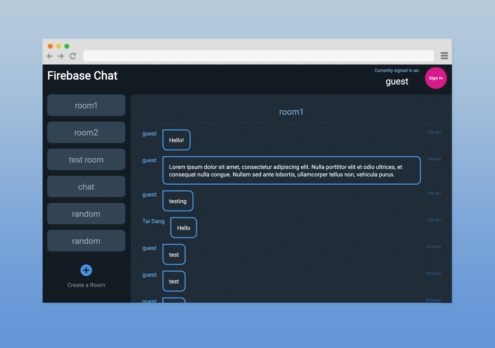

# Chat App

A simple App using React with Firebase to build an application that sends and receives messages in real time.

## General Info

This is a personal project to understand how Firebase works and how it integrates into a React application.

## Screenshots

## Technologies

- React 16.6.3 / bootstrapped with [Create React App](https://github.com/facebook/create-react-app)
- Firebase

## Setup

This project was bootstrapped with [Create React App](https://github.com/facebook/create-react-app).

### `npm start`

Runs the app in the development mode. 
Open [http://localhost:3000](http://localhost:3000) to view it in the browser.

The page will reload if you make edits. 
You will also see any lint errors in the console.

## Features

- Room creation
- Room display
- Chat room dialogue
- Chat creation
- User authentication

## Todo

- Admin user policy
- Room deletion by owner or admin
- Chat deletion by admin
- For Demo Purpose / reset firebase DB

## Status

- _in progress_

## Contact

- by [@taidang](https://dangarts.com) - feel free to contact me!
